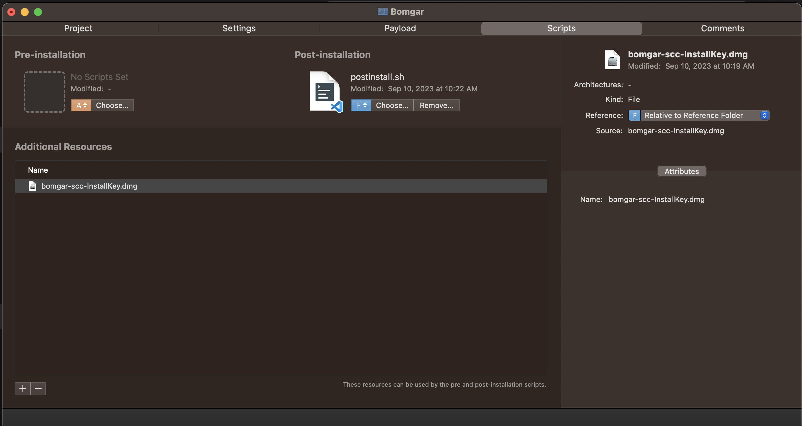

#Deploy Bomgar jump client on Mac OS with Intune

##Download
Downlaod & install [Pakckages for MacOS](http://s.sudre.free.fr/Software/Packages/about.html)
Download Bomgar-scc-<InstallKey> DMG for progragmmatic installation from your bomgar appliance
Download the "postinstall.sh" and "Bomgar.mobileconfig" files

##Create a custom pkg file
Open packages and create a raw project, name the project and add the working directory
Go to Scripts folder
Copy the postinstall.sh to project directory
Edit the postinstall.sh with your install key

On Packages script tab, import postinstall.sh and bomgar.dmg as additional resource

Command+B to build the package

Create a new Intune MacOS app and select PKG
