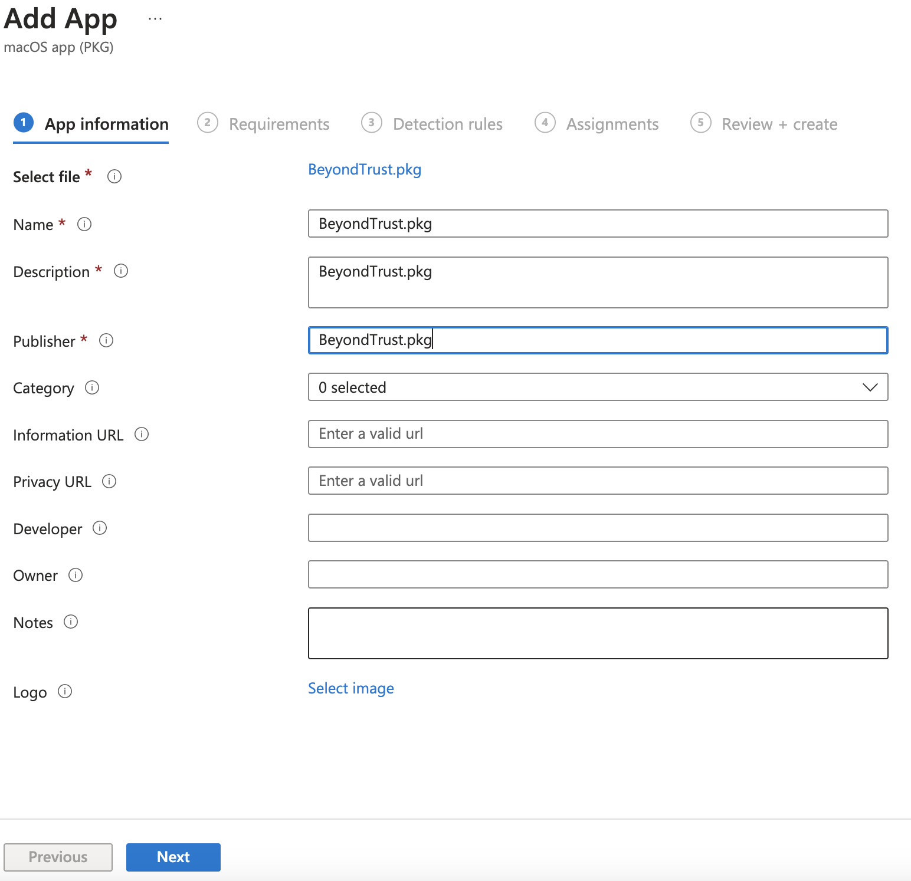

# ![AmirTamj][logo] Deploy BeyondTrust Bomgar jump client on Mac OS with Intune
[logo]: /images/Logo.png "AmirTamj Logo" {: style="height:150px;width:150px"}

## Download
Downlaod & install [Pakckages for MacOS](http://s.sudre.free.fr/Software/Packages/about.html).

Download Bomgar-scc-\<GUID\>.dmg for progragmmatic installation from your bomgar appliance.

Download the provided "postinstall.sh" and "Bomgar.mobileconfig" files.

## Create a custom pkg file
Open packages and create a raw project, name the project and add the working directory.

Copy the postinstall.sh and Bomgar-scc-\<GUID\>.dmg files to project directory.

Edit the postinstall.sh and replace the \<GUID\> with your dmg file name.
```
#!/bin/bash
PROCESS=bomgar
number=$(ps aux | grep -v grep | grep -ci $PROCESS)

if [ $number -eq 0 ]
    then    
        scriptDir=$(dirname $0)
        hdiutil attach -nobrowse -mountpoint /Volumes/bomgar-install $scriptDir/bomgar-scc-<GUID>.dmg
        sudo /Volumes/bomgar-install/Double-Click\ To\ Start\ Support\ Session.app/Contents/MacOS/sdcust --silent
        sleep 15
fi
```

On Packages, go to the script tab and import "postinstall.sh" and "bomgar.dmg" from the project folder.


Use Command+B or build menu to build the package.

## Deploy the package with Intune
Open Intune portal, navigate to Apps, \> macOS \> and Add.

Select "macOS app \(PKG\). 


Browse to project folder \> Build and upload the pkg file.

Enter name, description, and publisher info



Choose the desire minimum OS requirements, accept the default detection rule, assign to desired group for deployment, and create.

## Deploy Privacy and Security settings with Intune
In Intune, navigate to "Devices" \> macOS \> Configuration profiles, and create a profile.

Select Templates and Custom


Name the profile and click next. 

Browse to Bomgar.mobileconfig, click next and assign to desired group, and create the profile.


